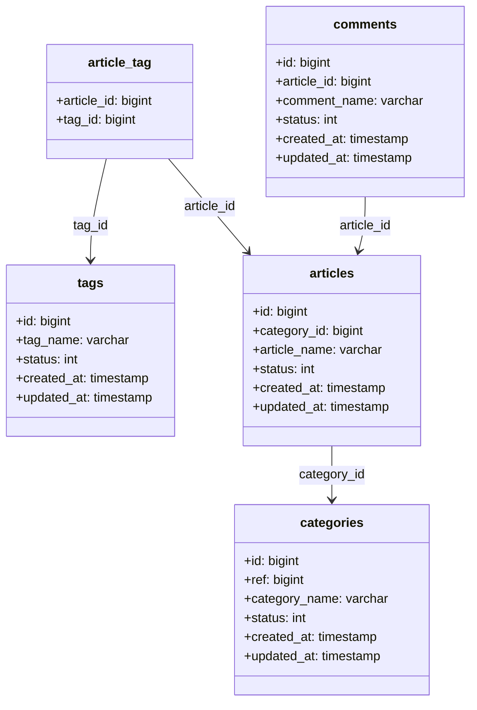

# Diagram

```mermaid
classDiagram
    class categories {
        +id: bigint
        +ref: bigint
        +category_name: varchar
        +status: int
        +created_at: timestamp
        +updated_at: timestamp
    }
    class tags {
        +id: bigint
        +tag_name: varchar
        +status: int
        +created_at: timestamp
        +updated_at: timestamp
    }
    class articles {
        +id: bigint
        +category_id: bigint
        +article_name: varchar
        +status: int
        +created_at: timestamp
        +updated_at: timestamp
    }
    class article_tag {
        +article_id: bigint
        +tag_id: bigint
    }
    class comments {
        +id: bigint
        +article_id: bigint
        +comment_name: varchar
        +status: int
        +created_at: timestamp
        +updated_at: timestamp
    }

    %% Relationships
    articles --> categories : category_id
    article_tag --> articles : article_id
    article_tag --> tags : tag_id
    comments --> articles : article_id

```